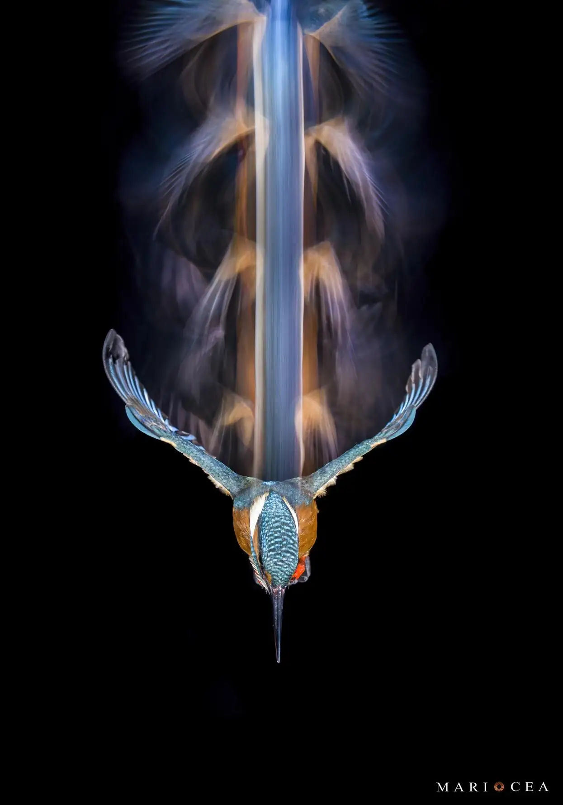
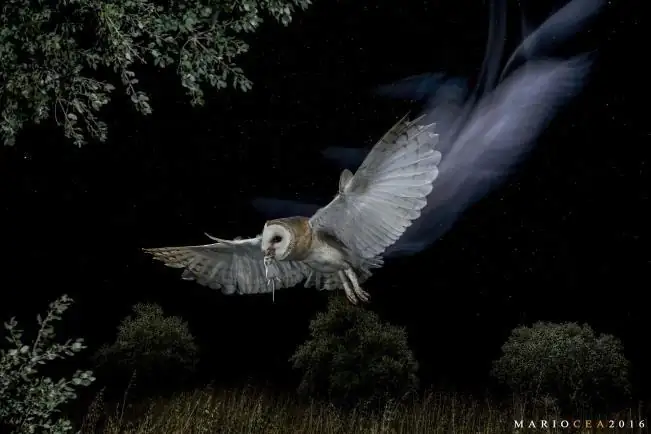
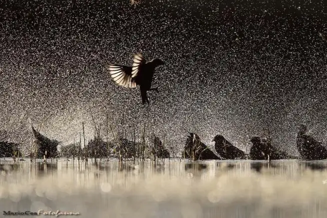
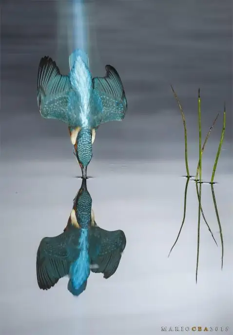
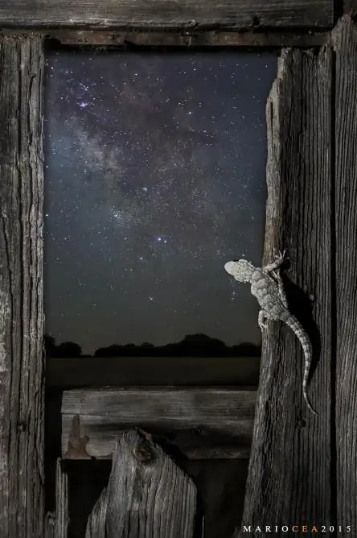
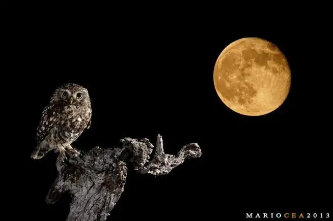

> [!TIP] Datos importantes
> **Fecha:** Días 20 y 21 de febrero (precongreso) \
> **Duración** 7-8 horas \
> **Lugar:** Priego de Córdoba \
> **Ponente:** <a href=https://www.mariocea.net/sobre-mi  target="_blank" rel="afopriego">Mario Cea</a>\
> **Aforo:** Ilimitado 

## Descripción del taller

El objetivo de este taller es aprender todos los secretos de esas “técnicas
especiales” que hoy en día están muy en auge y con las cuales se consiguen
imágenes de un gran impacto visual.


  


### Elementos del taller

- **Fotografía de alta velocidad con iluminación artificial:** Se montara un equipo completo de
  alta velocidad para ver su funcionamiento. Con esta técnica se logra parar cualquier
  movimiento por veloz que este sea.
- **Fotografía con múltiples exposiciones:** La fotografía de múltiple exposición nos brinda
  posibilidades infinitas para componer casi cualquier imagen que podamos imaginar.
- **Fotografía con dobles enfoques con un solo objetivo:** Con la técnica de doble enfoque
  podremos componer imágenes que nuestros equipos no son capaces de realizar por si mismos,
  consiguiendo enfoques tanto de primer plano como del infinito y todo en una sola imagen
  original.
- **Cambio de objetivo durante una larga exposición (único RAW original):** Explicaremos a
  fondo en que consiste la técnica de cambio de objetivo durante una larga exposición. Con esta
  técnica se consiguen imágenes imposibles y en un solo archivo original (RAW único).
- **Combinación de luces en la misma exposición:** Veremos cómo combinar diferentes tipos de
  luces durante una exposición para conseguir efectos creativos.

Conoceremos cuales son los mejores métodos a emplear para cada una de ellas, que condiciones
meteorológicas son las más propicias, así como los mejores materiales para conseguir casi
cualquier imagen que podamos imaginar.

  


Este tipo de “técnicas especiales” suelen dar como resultado imágenes únicas y originales y en
muchas ocasiones irrepetibles, algo que todos los fotógrafos queremos tener en nuestro archivo.

### Sobre el ponente
<a href=https://www.mariocea.net/sobre-mi  target="_blank" rel="afopriego">Mario Cea</a> es un fotógrafo profesional de naturaleza especializado en fauna salvaje y en técnicas especiales y creativas. 
Con más de 25 años de experiencia, sus obras fotográficas han sido galardonadas más de 80 veces en diferentes certámenes internacionales sobre esta temática entre los que destacan Wildlife Photographer Of The Year, GDT, Asferico, Bird Photographer Of The Year, OASIS Photo Contest, Nature's Best  Photography, AMBID, Memorial Maria Luisa, Montphoto, etc. 

## Galería de Mario Cea


  
  
  
  
  
  


