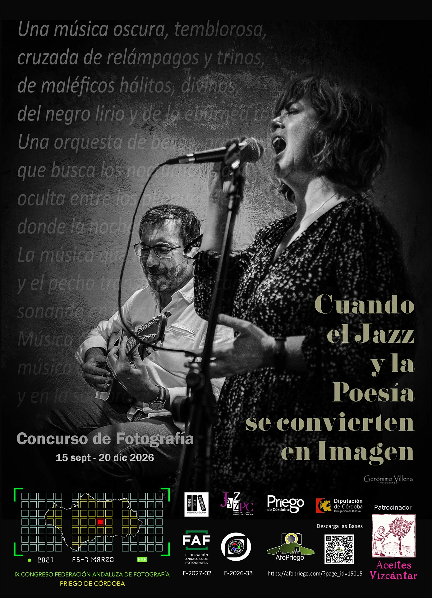
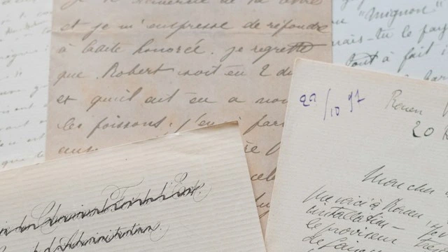

> [!TIP] Datos importantes
> **Fechas:** 15 de septiembre - 20 de diciembre de 2026 \
> **Fallo del Jurado:** Enero de 2027  \
> **Lugar:** Priego de Córdoba \
> **Participación:** Gratuita 

## Bases del concurso

La Asociación Fotográfica Afopriego, la Asociación Jazz-Pc, la Asociación amigos de la biblioteca, y el
Ayuntamiento de Priego de Córdoba, en colaboración con la Federación Andaluza de Fotografía, con
motivo de la celebración del IX congreso de FAF, en dicha ciudad y del centenario de la Generación
del 27, convocan el siguiente concurso fotográfico.


  


### Participación
Participación abierta y gratuita para todas aquellas personas que realicen la inscripción en la
plataforma de <a href=https://faf.fotogenius.es/ target=_blank>Fotogenius</a>.

### Tema principal
Fotografía de tema libre relacionada e inspirada en un tema de música de jazz y en uno
de los poemas de los autores de la generación del 27.


  


### ¿Cómo se concursa?
Se presentan diez series numeradas del 1 al 10, que son parejas de poema y melodía musical.
El tema musical puede oírse activando código QR que aparece con cada poema.
**Cada autor debe escoger un máximo de 4 parejas/series**, y realizar una fotografía para cada
una de las cuatro series escogidas.
A la hora de presentar las fotografías a la plataforma Fotogenius. Tiene que renombrar cada
fichero con el Nº de serie escogida + Título.

> [!TIP]+ Ejemplo:
> *Foto nº 1 → Serie 3. Musa inspiradora*  
*Foto nº 2 → Serie 7. La tarde*  
*Foto nº 3 → Serie 10. Un paseo en el tiempo* 
*Foto nº 4 → Serie 5. Eternidad*
{icon="eye"}

### Formato
Las imágenes deberán enviarse en formato .JPG con una resolución mínima de 200 ppp y un
tamaño máximo de 5.000 píxeles en su lado mayor, y peso no superior a 5 Mb.

- **No se admitirán** imágenes creadas por inteligencia artificial, ni siquiera de manera parcial.
- **Se permiten** montajes, superposiciones, dobles exposiciones y alteraciones digitales
avanzadas, siempre que sean realizadas con negativos fotográficos o archivos digitales
originales del autor de las fotografías enviadas.
- **Se permiten técnicas** de edición que mejoren la presentación de las fotografías, incluyendo
HDR, “focus stacking”, “Dodge and burn” y/o técnicas blending (o fusión de imágenes). Se
permiten técnicas que eliminen elementos añadidos por la cámara, como manchas de
polvo, ruido digital y arañazos de la película. Todos los ajustes permitidos no podrán
alterar la naturaleza de la fotografía.
- Las imágenes en color se pueden convertir en monocromo. 

En caso de plantearse alguna duda al respecto, la organización podrá requerir al autor que
acredite la integridad de la fotografía o el cumplimiento de las bases por cualquier medio válido
en derecho.

### Envío fotografías
Las fotografías deberán enviarse a la página web <a href=https://faf.fotogenius.es/ target=_blank>faf.fotogenius.es</a> completando el envío con
los datos que se exigen. El sistema envía un correo electrónico que confirma la subida de las
fotografías.

### Cronograma
**Apertura:** día 15 de septiembre de 2026  
**Cierre:** 20 de Diciembre de 2026 a las 23:59h  
**Fallo del Jurado:** Enero de 2026 
**Comunicación de resultados en el IX Congreso de la FAF:** 10 fotos finalistas 
**Comunicación Ganadores y Entrega de premios:** Gala de IX Congreso 
La comisión organizadora establecerá una fecha de la inauguración de la exposición. 

## Premios
#### 1º Premio Medalla oro CEF y Medalla de oro FAF y 300€
#### 2º Premio Medalla plata FAF y 200€
#### 3º Premio Medalla bronce FAF y Lote de Aceites Vizcántar
#### 4º y 5º Mención de Honor CEF
#### 6º al 10 Mención de Honor FAF  

Se contabilizarán para las distinciones FAF y CEF el 15% de las obras presentadas que mayor
puntuación obtengan.

La entrega de premios se realizará durante la Gala del IX congreso de la Federación Andaluza
de Fotografía
 
 
Ver las bases


